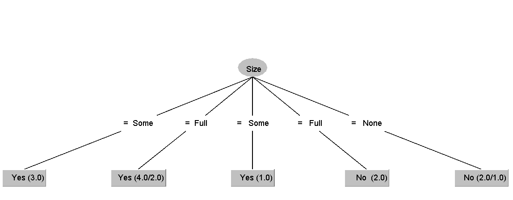
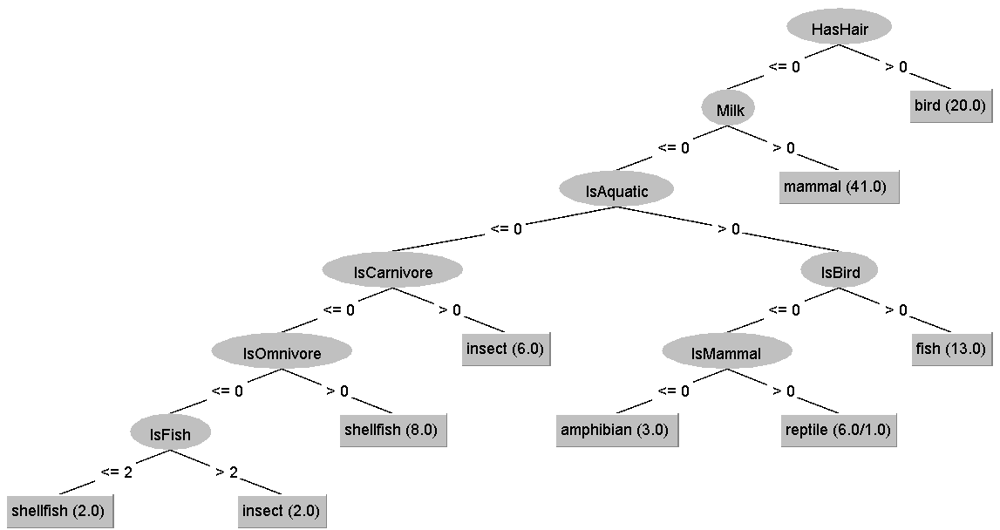
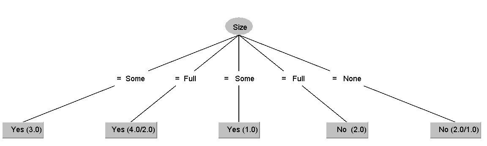
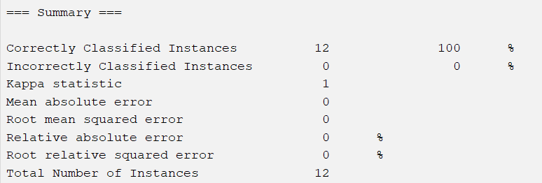

DTL.01
    Gegebene Werte:
        S1 = 4
        S2 = 0.7

        Nr. 	Alter 	Einkommen 	Bildung 	Kandidat
        1 	    ≥ 35 	hoch 	    Abitur 	    O
        2 	    < 35 	niedrig 	Master 	    O
        3 	    ≥ 35 	hoch 	    Bachelor 	M
        4 	    ≥ 35 	niedrig 	Abitur 	    M
        5 	    ≥ 35 	hoch 	    Master 	    O
        6 	    < 35 	hoch 	    Bachelor 	O
        7 	    < 35 	niedrig 	Abitur 	    M
    CAL3:
        Beispiel    Entscheidungsbaum nach Verarbeiten des Beispiels
        1           / O1 /
        2           / O2 /
        3           / O2 M1 /
        4           / O2 M2 /                                                                       # N ist nun gleich S1=4, also wird auf Abschluss/Differenzierung geprüft
        P(O)=2/4 <S2, P(M)=2/4 <S2 -> Differenzierung nach Alter: x1(*, *)                          # In x1(*, *): Links Alter >35, Rechts <35
        4           x1(/M1/, *)                                                                     # Beispiel 4 muss/sollte nach Differenzierung nochmal genommen werden
        5           x1(/O1 M1/, *)
        6           x1(/O1 M1/, /O1/)
        7           x1(/O1 M1/, /O1 M1/)
        1           x1(/O2 M1/, /O1 M1/)
        2           x1(/O2 M1/, /O2 M1/)
        3           x1(/O2 M2/, /O2 M1/)
        P(O)=2/4 <S2, P(M)=2/4 <S2 -> Differenzierung nach Einkommen: x1(x2(*, *), /O2 M1/)         # In x2(*, *): Links Einkommen hoch, rechts Einkommen niedrig
        3           x1(x2(/M1/, *), /O2 M1/)
        4           x1(x2(/M1/, /M1/), /O2 M1/)
        5           x1(x2(/O1 M1/, /M1/), /O2 M1/)
        6           x1(x2(/O1 M1/, /M1/), /O3 M1/)
        P(O)=3/4 >S2 -> Abschluss, ersetze durch O: x1(x2(/O1 M1/, /M1/), O)                        # Beispiele 2, 6 und 7 werden ab hier übersprungen, da alles mit Alter<35 schon als O entschieden wurde
        1           x1(x2(/O2 M1/, /M1/), O)
        3           x1(x2(/O2 M2/, /M1/), O)
        P(O)=2/4 <S2, P(M)=2/4 <S2 -> Differenzierung nach Bildung: x1(x2(x3(*, *, *), /M1/), O)    # In x3(*, *, *): Links Bildung Abitur, Mitte Master, Rechts Bachelor
        3           x1(x2(x3(*, *, /M1/), /M1/), O)
        4           x1(x2(x3(*, *, /M1/), /M2/), O)
        5           x1(x2(x3(*, /O1/, /M1/), /M2/), O)
        1           x1(x2(x3(/O1/, /O1/, /M1/), /M2/), O)
        [...]                                                                                       # Ab hier werden Beispiele 3, 4, 5, 1 weiter durchgegangen, bis die jeweiligen Vereinigungsklassen 4 O bzw. 4 M haben
        Ergebnis:   x1(x2(x3(O, O, M), M), O)

    ID3:
        Entropie der Zielklassen:
            v1 = O,     v2 = M                      # Zielklassen
            p1 = 4/7    p2 = 3/7                    # Relative Häufigkeiten
            H(V) = - (p1 * log2 p1 + p2 * log2 p2)  # Entropie Formel
            log2 p1 = log2 4/7 = -0.81
            log2 p2 = log2 3/7 = -1.22
            H(V) = - (4/7 * -0.81 + 3/7 * -1.22) = -0.99
        Gain(x1):                                           # Merkmal Alter
            S1 = 1, 3, 4, 5,    S2 = 2, 6, 7,               # Merkmalsausprägungen, S1 für >35, S2 für <35
            H(S1) = - (2/5 * log2(2/5) + 3/5 * log2(3/5)) = - (2/5 * -0.64 + 3/5 * -0.737) = 0.746
            H(S2) = - (2/3 * log2(2/3) + 1/3 * log2(1/3)) = - (2/3 * -0.585 + 1/3 * -1.585) = 0.918
            H(Alter) = (5/7 * H(S1) + 3/7 * H(S2)) = (5/7 * 0.746 + 3/7 * 0.918) = 0.818
            Gain(x1) = H(V) - H(Alter) = 0.99 - 0.818 = 0.172
        Gain(x2):                                           # Merkmal Einkommen
            S1 = 1, 3, 5, 6,    S2 = 2, 4, 7                # Merkmalsausprägungen, S1 für hohes Einkommen, S2 für niedriges
            H(S1) = - (3/4 * log2(3/4) + 1/4 * log2(1/4)) = - (3/4 * -0.415 + 1/4 * -2) = 0.811
            H(S2) = - (1/3 * log2(1/3) + 2/3 * log2(2/3)) = - (1/3 * -1.585 + 2/3 * -0.585) = 0.918
            H(Einkommen) = (4/7 * H(S1) + 3/7 * H(S2)) = (4/7 * 0.811 + 3/7 * 0.918) = 0.868
            Gain(x2) = H(V) - H(Einkommen) = 0.99 - 0.868 = 0.122
        Gain(x3):                                           # Merkmal Bildung
            S1 = 1, 4, 7,       S2 = 2, 5,      S3 = 3, 6   # Merkmalsausprägungen, S1 für Abitur, S2 für Master, S3 für Bachelor
            H(S1) = - (2/3 * log2(2/3) + 1/3 * log2(1/3)) = - (2/3 * -0.585 + 1/3 * -1.585) = 0.918
            H(S2) = - (0.5 * log2(0.5) + 0.5 * log2(0.5)) = - (0.5 * -1 + 0.5 * -1) = 1
            H(S3) = - (1 * log2(1)) = 0
            H(Bildung) = (3/7 * H(S1) + 2/7 * H(S2) + 2/7 * H(S3)) = (3/7 * 0.918 + 2/7 * 1 + 2/7 * 0) = 0.68
            Gain(x3) = H(V) - H(Bildung) = 0.99 - 0.68 = 0.31
        Durchführung:
            Merkmal mit höchstem gain auswählen: x3
            Differenzieren nach x3 : {1, 4 , 7}, {2, 5}, {3, 6}
                {2, 5} -> Löst nach O auf, da nur O gewählt
                {3, 6} -> Präzisieren mit x1: {M, O}
                {1, 4, 7} -> Präzisieren mit x2: {O, M}
            Ergebnis : x3(x2(O, M), O, x1(M, O))

DTL.02
    x3(x2(x1(C, A), x1(B, A)),  x1(x2(C, B),A)) 
    x3(x1(x2(C, B), A),         x1(x2(C, B),A))             # Transformationsregel
    x3(x1(x2(C, B), A))                                     # Redundantes x1(x2(C, B),A)
    x1(x2(C, B), A)                                         # Irrelevantes x3

DTL.03
    1.
                                    
        Fehlerrate : 25%
        Confusion Matrix : Da es nur wenige Datensätze gibt ist der Baum sehr inakkurat
        
        Fehlerrate : 0.99%
    2.
        Nominale Attribute akzeptierten nur vordefinierte Werte
        Numerische Attribute akzeptieren Zahlen
        String-Attribute akzeptieren Strings
    3.
        
        Der Baum ist identisch zum Baum vom .csv Format
        
        Der Id3 Baum hat eine Fehlerquote von 0% und ist somit (in diesem Fall) präziser.
